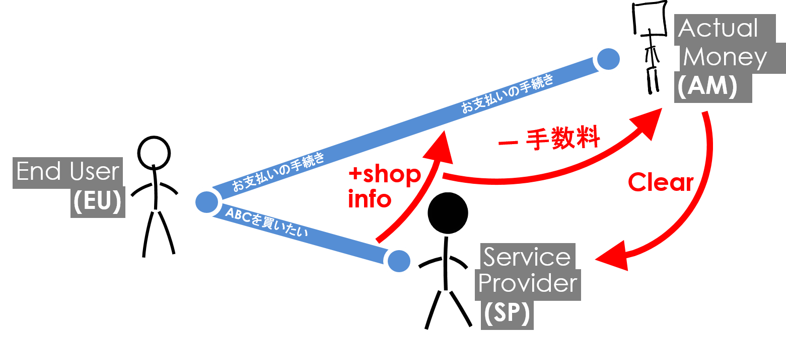
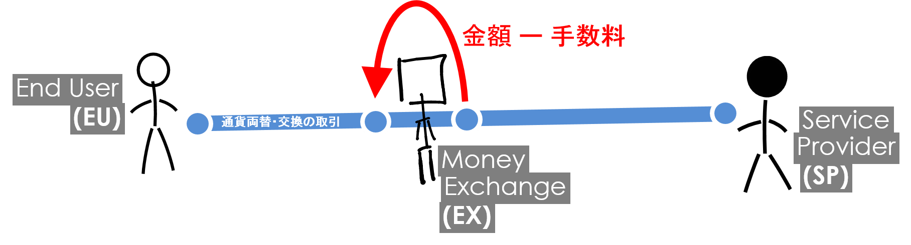
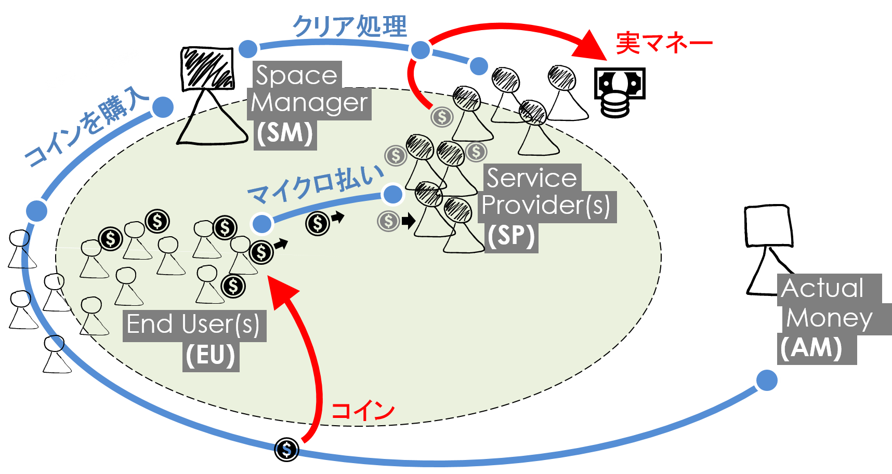

[数の多いヘタな物](./)の中で**マイクロ払い**の下手なところを直しましょう。

# （通常の）クレジットカード系払い方法

図のようなケースは普通の買い物と同じものです。

例えばどこかの（オンラインの）お店で何かを購入する時にクリックします。
その場合、（よくあるパターンとして）お店のページからクレジットカード＝お支払いページへ転送される仕組みが普通です。自分側では、クレジットカード情報入力して取引を完成させますと、取引が完成される。取引が終わった時点で、お店に、**手数料を引いた金額**が入ることで、取引全体は終わりです。

問題は、もちろん、**手数料**です。定額、無視できない％などになっているため、なかなか小さいな金額を（商品に）載せることができなくなっている。具体的な数字は出せませんが、100円を下回っている金額に対して、手数料を引いたときにマイナス（か他の意味でも損失）になることです。

実は、その理由だけで、100円以下の金額はあまり見られないかと思います。

# ピア間の取引で手数料を無くすことができるじゃん！

このケースは全く異なる取引となるのは確かです。でも、それにしても、**取引コスト**が存在します。

図のような場面を考えましょう。実は、ユーザーとサービス提供者は、2者ともシステムにとっては2人のユーザーです。システム自体は、ハーブみたいな役割がなければ、2人のユーザ間の取引に信用することがとても難しくなります。詐欺などの可能性を含めて、ユーザが簡単に騙されるから危ないです。従って、やはりピアツーピア（P2P）のような形にし、システム自体をミドルマンにしたことで、信頼度が比較的に高くなる。

で、こいうイメージは、仮想通貨にピッタリ当てはまる。ただし、ビットコインなど仮想通貨をつかって、こいう交換・両替のケースにしても**手数料が発生**します！確かに、「手数料ゼロ」と案内しているシステム（仮想通貨の市場）が存在していますが、金額によるものであったりして、金額が高ければ高いほど手数料もどんどん発生していく形が、実際に、多い。

# 実マイクロ払い技術（本版）

で、今の話を理論に落としましょう
理論にした時はこいう話は**取引コスト経済**と呼ばれる。
この分野では、2者以上が同じ取引に入った時の、コストを評価・計算などをすることが目的です。
マイクロ払いの話とどうやってつながってるかと言いますと、取引コスト経済の話を元にして、**取引コストをできるだけ減らす**ような仕組みを考えるのが、マイクロ払い方法・技術の必要性でもあり、目的でもある。

図のような場面を中心に考えましょう。
まず、何らかの**スペース**とその**スペース管理者**が存在します。
このスペースの中でサービス提供者とその利用者が両方も複数の形で存在している。

で、取引に入る前に準備をする必要があります。
それは**コインを購入**することです。
図で示したように、一般ユーザーが普通のクレジットカードなどの仕組みを使ってスペースに入る前に（仮想）コインをゲットする。
今の時点ではサービス提供した側で何もしなくても良いです。

じゃ、具体的に、実時間で、ユーザーとサービス提供者の取引を解析しましょうj。
たとえば、ユーザーがサービス提供者が提供している何らかのサービスに気付いて、そのサービスを受けたいとします。
例えば、電車駅内の広告に使われている画面を引っ張って自分のスマホから写真を出すことに、
例えば1円を払って10分ぐらい使う～～～という形ぐらいのサービスを考えている。
その時にユーザーがすでにコインを持っているのでサービスを受けるときに、コインの一部（1円ぐらいでもよい）をサービス提供者に渡すことになります。
提供者側では、そのコインの一部（もちろんハッシュ値などの形で）を受けて、貯めておく。

ちなみに、図の通り、サービス提供者に渡ったコインが少し違った色で示されている。
これには具体的に意味がついている。
このコインは、実際のお金ではなくて、**「お金をもらう可能性」**を示しているからです。

そこで、最終段階では、各サービス提供者が集めてきたコインをスペース管理所と**クリアする**必要がある。クリアが成功した場合、サービス提供者側でも実際のお金が手に入る形になる。

ちなみに、こいう形のサービスにすると、サービス提供者側でとても面白い多様化が可能になる。
例えば、ユーザーから渡ってきたコインの一部をどこまで集めていくか～～のを判断するところが科学的に面白い。なぜなら「クリア処理を叩く」ときに スペース管理者側で手数料が発生してしまうからです。その手数料を避けるために、できるだけ 多くのマイクロ払い取引を集約する必要がある。
ただし、どこまで集約するかのは、各サービス提供者側の判断に任せられているので、とても多様なシステムになりそうな感じはします。

ベターなものはこれで以上です。

